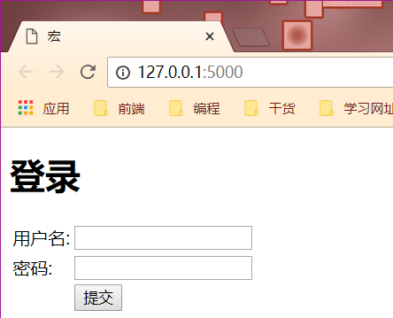

# 25 宏的概念和基本使用

模块中的宏跟python中的函数类似，可以传递参数，但是不能有返回值，可以将一些经常用到的代码片段放到宏中，然后把一些不固定的值抽取出来当成一个变量。

```text

    函数

```

```text
app.py

from flask import Flask, render_template

app = Flask(__name__)
app.config['TEMPLATES_AUTO_RELOAD'] = True

@app.route('/')
def hello_world():
    return render_template("index/index.html",username="angle")


if __name__ == '__main__':
    app.run(debug=True)
```

```text
index.html



<!DOCTYPE html>
<html lang="en">
<head>
    <meta charset="UTF-8">
    <title>宏</title>
</head>
<body>
    <h1>登录</h1>
    <table>
        <tbody>
            <tr>
                <td>用户名:</td>
                <td>{{ macros.input("username") }}</td>
            </tr>
            <tr>
                <td>密码:</td>
                <td>{{ macros.input(name="password",type="password") }}</td>
            </tr>
            <tr>
                <td></td>
                <td>{{ macros.input(value="提交",type="submit") }}</td>
            </tr>
        </tbody>
    </table>
</body>
</html>
```

```text
macors.html


    <input type="{{ type }}" name="{{ name }}" value="{{ value }}"/>

```



