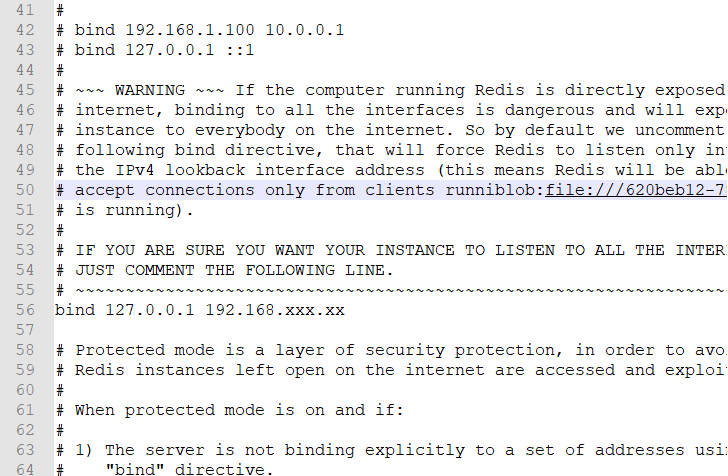

# 124 其他机器连接本机redis

* 打开配置文件,windows下的配置文件为"redis.windows-service.conf"，Ubuntu下的配置文件为"redis.conf"
* Ubuntu
  * cd /etc/redis,vim redis.conf
* windows
  * 找到配置文件，使用notepad记事本打开
* 找到bind,进行修改绑定本机地址

```text
bind 127.0.0.1 本机地址
```



